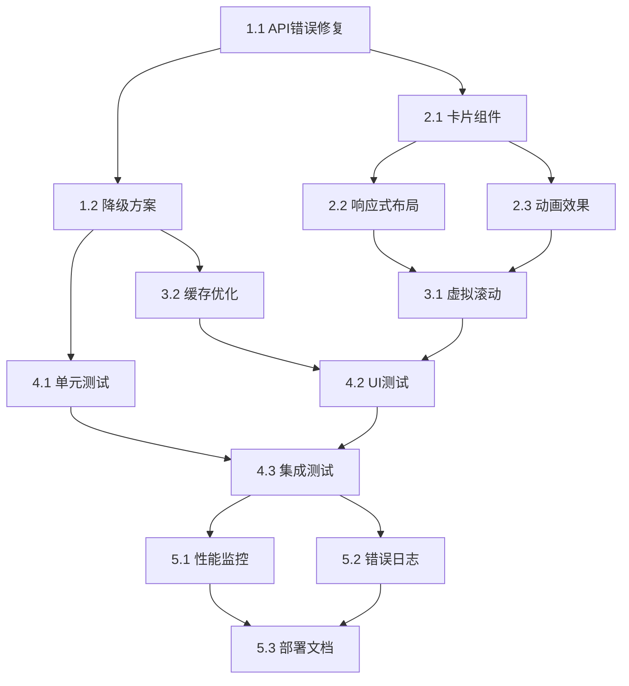

# 基金探索UI优化和排行卡片数据加载 - 任务清单

## 📋 实施任务

### 1. 🔧 API稳定性优化 (优先级：高)
- [ ] 1.1 **修复XMLHttpRequest错误和URL编码问题**
    - *目标*: 解决基金排行API加载失败的核心问题
    - *详情*:
      - 修复`fund_service.dart`中的双重URL编码问题
      - 增强CORS头部处理，适配Web平台
      - 优化HTTP客户端配置，增加超时设置
      - 实现智能重试机制（最多3次）
    - *需求关联*: 3.1.1, 4.2
    - *预计工时*: 4小时

- [ ] 1.2 **实现多层级降级方案**
    - *目标*: 确保API失效时应用仍能正常运行
    - *详情*:
      - 完善`_generateMockFundRankings`方法实现
      - 创建备用API接口调用机制
      - 实现缓存优先策略
      - 添加降级方案状态提示
    - *需求关联*: 3.1.2, 4.1
    - *预计工时*: 6小时

- [ ] 1.3 **增强错误处理和日志记录**
    - *目标*: 提供完善的错误处理和调试信息
    - *详情*:
      - 实现`ErrorHandlerService`错误分类处理
      - 添加详细的错误日志记录
      - 创建用户友好的错误提示组件
      - 实现错误恢复引导流程
    - *需求关联*: 3.1.2, 8.1
    - *预计工时*: 3小时

### 2. 🎨 UI组件重构 (优先级：高)
- [ ] 2.1 **基金排行卡片组件优化**
    - *目标*: 重新设计基金排行卡片，提升信息展示效果
    - *详情*:
      - 创建新的`FundRankingCard`组件
      - 优化信息层次结构，突出关键数据
      - 实现卡片悬停效果和点击动画
      - 添加展开/收起功能，支持更多数据展示
    - *需求关联*: 3.2.1, 3.2.3, 6.1
    - *预计工时*: 8小时

- [ ] 2.2 **实现响应式布局系统**
    - *目标*: 适配不同屏幕尺寸和设备类型
    - *详情*:
      - 实现`ResponsiveLayout`工具类
      - 创建断点检测和适配逻辑
      - 优化移动端和桌面端的显示差异
      - 测试各种屏幕尺寸的显示效果
    - *需求关联*: 4.3, 6.4
    - *预计工时*: 4小时

- [ ] 2.3 **添加动画和交互效果**
    - *目标*: 提升用户体验，增加视觉吸引力
    - *详情*:
      - 实现卡片进入动画（淡入+滑动）
      - 添加数据加载动画和骨架屏
      - 创建平滑的过渡效果
      - 优化触摸反馈和手势响应
    - *需求关联*: 3.2.2, 6.3
    - *预计工时*: 5小时

### 3. ⚡ 性能优化 (优先级：中)
- [ ] 3.1 **实现虚拟滚动和懒加载**
    - *目标*: 优化长列表的性能表现
    - *详情*:
      - 实现`FundRankingList`的虚拟滚动
      - 添加可见区域检测逻辑
      - 优化内存使用，及时回收不可见卡片
      - 实现渐进式加载更多数据
    - *需求关联*: 3.3.1, 7.1
    - *预计工时*: 6小时

- [ ] 3.2 **数据缓存机制优化**
    - *目标*: 减少网络请求，提升响应速度
    - *详情*:
      - 完善`FundCacheService`实现
      - 添加内存缓存和磁盘缓存
      - 实现智能缓存更新策略
      - 支持离线数据访问
    - *需求关联*: 3.3.2, 5.2
    - *预计工时*: 5小时

- [ ] 3.3 **网络请求优化**
    - *目标*: 减少网络开销，提升加载速度
    - *详情*:
      - 实现请求合并和批量处理
      - 添加请求去重机制
      - 优化图片和资源加载
      - 启用压缩传输
    - *需求关联*: 7.3
    - *预计工时*: 3小时

### 4. 🧪 测试与验证 (优先级：中)
- [ ] 4.1 **单元测试编写**
    - *目标*: 确保代码质量和功能正确性
    - *详情*:
      - 为`FundService`编写完整的单元测试
      - 测试API调用、错误处理、降级方案
      - 验证数据解析和模型转换
      - 实现Mock数据和服务
    - *需求关联*: 9.1
    - *预计工时*: 4小时

- [ ] 4.2 **UI组件测试**
    - *目标*: 验证UI组件的正确渲染和交互
    - *详情*:
      - 为`FundRankingCard`编写Widget测试
      - 测试卡片展开/收起功能
      - 验证响应式布局适配
      - 测试动画效果和交互反馈
    - *需求关联*: 9.2
    - *预计工时*: 3小时

- [ ] 4.3 **集成测试和性能测试**
    - *目标*: 验证整体功能流程和性能指标
    - *详情*:
      - 编写端到端的集成测试
      - 测试完整的用户操作流程
      - 验证性能指标（加载时间、内存使用）
      - 进行压力测试和稳定性测试
    - *需求关联*: 9.3, 4.1
    - *预计工时*: 4小时

### 5. 📊 监控与部署 (优先级：低)
- [ ] 5.1 **性能监控实现**
    - *目标*: 实时监控应用性能和用户行为
    - *详情*:
      - 实现`PerformanceMonitor`监控类
      - 添加API延迟、渲染时间统计
      - 实现错误率和成功率监控
      - 创建性能报告和告警机制
    - *需求关联*: 10.1
    - *预计工时*: 3小时

- [ ] 5.2 **错误日志系统完善**
    - *目标*: 建立完善的错误追踪和分析系统
    - *详情*:
      - 完善`ErrorLogger`实现
      - 实现错误分类和统计
      - 添加用户行为追踪
      - 创建错误分析报告
    - *需求关联*: 10.2
    - *预计工时*: 2小时

- [ ] 5.3 **部署文档和运维指南**
    - *目标*: 提供完整的部署和运维文档
    - *详情*:
      - 编写部署指南和配置说明
      - 创建运维监控配置
      - 编写故障排查手册
      - 提供性能调优建议
    - *需求关联*: 11.2
    - *预计工时*: 2小时

## 🔗 任务依赖关系

## ⏰ 预计时间线

### 第一阶段：核心功能修复 (1-2天)
- **1.1 API错误修复**: 4小时
- **1.2 降级方案**: 6小时
- **1.3 错误处理**: 3小时
- **小计**: 13小时

### 第二阶段：UI组件开发 (2-3天)
- **2.1 卡片组件优化**: 8小时
- **2.2 响应式布局**: 4小时
- **2.3 动画效果**: 5小时
- **小计**: 17小时

### 第三阶段：性能优化 (1-2天)
- **3.1 虚拟滚动**: 6小时
- **3.2 缓存机制**: 5小时
- **3.3 网络优化**: 3小时
- **小计**: 14小时

### 第四阶段：测试验证 (1天)
- **4.1 单元测试**: 4小时
- **4.2 UI测试**: 3小时
- **4.3 集成测试**: 4小时
- **小计**: 11小时

### 第五阶段：监控部署 (0.5天)
- **5.1 性能监控**: 3小时
- **5.2 错误日志**: 2小时
- **5.3 部署文档**: 2小时
- **小计**: 7小时

## 📈 总计
- **总任务数**: 15个
- **预计总工时**: 62小时
- **预计开发周期**: 8-9个工作日
- **风险缓冲**: 增加20%时间，总计约10-11个工作日

## 🎯 关键里程碑

1. **M1**: API稳定性修复完成 (第2天结束)
2. **M2**: UI组件重构完成 (第5天结束)
3. **M3**: 性能优化完成 (第7天结束)
4. **M4**: 测试验证完成 (第8天结束)
5. **M5**: 项目交付 (第11天结束)

## ⚠️ 风险评估与缓解

### 高风险项目
- **API接口变更**: 密切关注接口文档更新
- **性能瓶颈**: 提前进行性能基准测试
- **兼容性问题**: 多设备多平台充分测试

### 缓解措施
- 每日进度跟踪和代码审查
- 关键节点增加测试验证
- 保持与需求方密切沟通
- 预留20%时间缓冲

---

**任务计划版本**: v1.0
**制定日期**: 2025-09-21
**项目负责人**: 猫娘工程师-幽浮喵
**预计开始时间**: 待确定
**预计完成时间**: 待确定