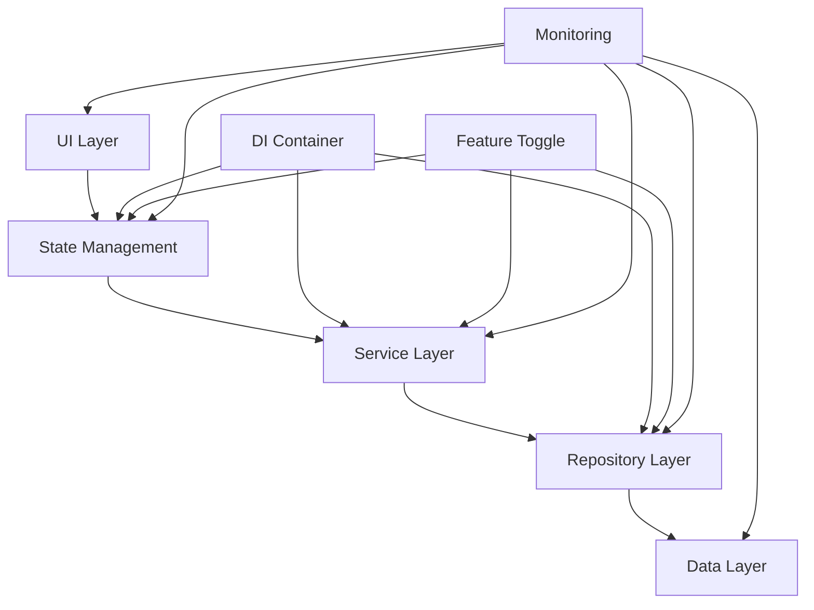

# Story R.0: 架构蓝图设计

**Epic**: Epic R - 架构重构与代码清理
**创建日期**: 2025-11-17
**工作量**: 8小时
**优先级**: 🔥 极高
**状态**: done

---

## 📋 故事概述

建立架构重构的蓝图和基础，设计统一的技术架构，制定重构标准和规范，为后续的重构工作奠定坚实基础。

### 业务价值
- **重构指导方向**: 为整个重构项目提供清晰的技术方向
- **风险控制**: 提前识别和规避架构风险
- **质量保证**: 建立统一的技术标准和质量要求

### 技术目标
- 设计统一的技术架构
- 制定重构标准和规范
- 建立Feature Toggle机制
- 设计监控和告警系统

---

## 🎯 验收标准

### 功能验收
- [ ] 统一技术架构设计完成
- [ ] 重构标准和规范制定完成
- [ ] Feature Toggle机制设计确定
- [ ] 监控告警系统设计完成

### 质量验收
- [ ] 架构设计通过技术评审
- [ ] 重构风险识别和缓解措施确定
- [ ] 团队对架构理解一致

---

## 🔧 技术实现

### 架构设计原则
1. **单一职责原则**: 每个模块职责单一明确
2. **开闭原则**: 对扩展开放，对修改关闭
3. **依赖倒置原则**: 依赖抽象而非具体实现
4. **接口隔离原则**: 接口专一，避免"胖接口"

### 核心架构组件

#### 1. 状态管理架构
- 统一BLoC模式
- GlobalCubitManager优化
- Feature Toggle机制

#### 2. 服务层架构
- API Gateway模式
- 服务合并策略
- 依赖注入优化

#### 3. 数据层架构
- Repository模式
- 三级缓存策略
- 数据流优化

#### 4. 组件架构
- 设计系统建立
- 组件库体系
- 性能优化策略

#### 5. 依赖注入架构
- GetIt配置优化
- 接口抽象层
- 环境切换支持

---

## 📊 架构蓝图

### 整体架构图

### 技术栈选择
- **状态管理**: BLoC Pattern + Cubit (过渡期)
- **网络请求**: Dio + Retrofit
- **数据持久化**: Hive + SQL Server
- **依赖注入**: GetIt
- **图表组件**: fl_chart
- **UI框架**: Flutter + Material Design

---

## 📈 重构策略

### 渐进式重构原则
1. **向后兼容**: 保持现有功能正常运行
2. **安全切换**: 通过Feature Toggle安全切换新旧实现
3. **分阶段实施**: 按Story分阶段实施，每阶段可独立验证
4. **质量保证**: 每个阶段都有完整的测试覆盖

### 风险控制策略
1. **备份机制**: 关键数据和配置的完整备份
2. **回滚能力**: 每个变更都具备快速回滚能力
3. **监控告警**: 实时监控系统健康状态
4. **测试覆盖**: 完整的自动化测试套件

---

## 📝 影响范围

### 技术影响
- 影响整个应用架构
- 涉及所有主要模块
- 需要团队全面配合

### 业务影响
- 用户无感知的架构升级
- 系统性能和稳定性提升
- 开发效率和维护性改善

---

## 🔗 后续故事依赖

本故事为以下故事提供基础：
- [Story R.1: 状态管理统一化](story-r1-state-unification.md)
- [Story R.2: 服务层重构](story-r2-service-refactor.md)
- [Story R.3: 数据层清理](story-r3-data-cleanup.md)
- [Story R.4: 组件架构重构](story-r4-component-refactor.md)
- [Story R.5: 依赖注入重构](story-r5-di-refactor.md)

---

## 📚 相关文档

- [架构设计文档](../../../docs/architecture.md)
- [重构计划](../../../docs/refactoring-plan.md)
- [技术规范](../../../docs/technical-specifications.md)

---

**最后更新**: 2025-11-17
**负责人**: 架构师团队
**审核人**: 技术委员会
**状态**: 已完成 ✅