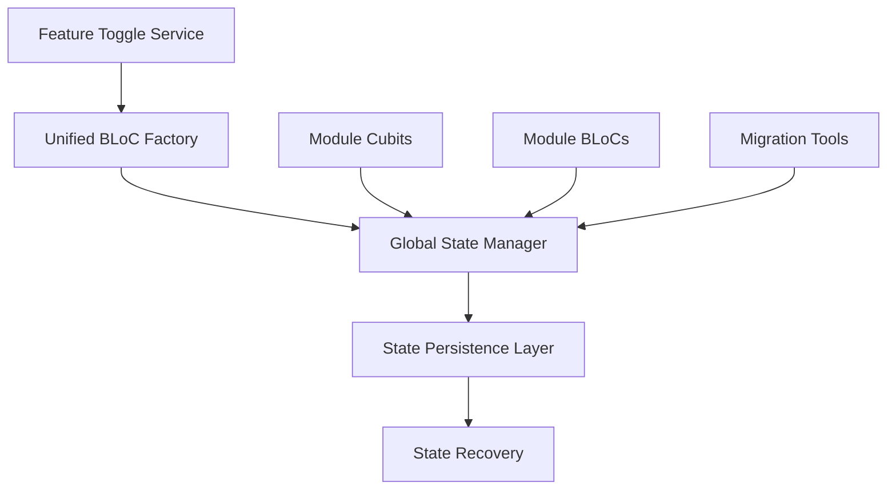
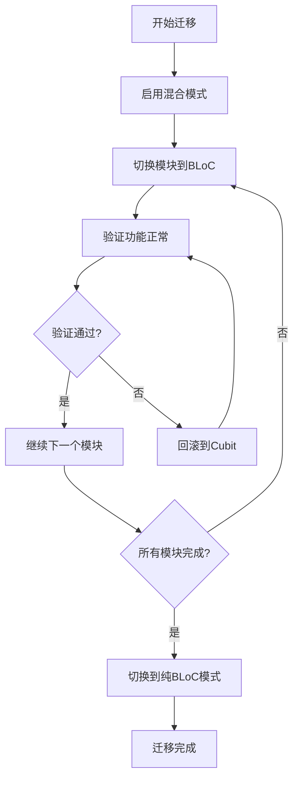

# 状态管理统一化技术文档

## 概述

本文档描述了基速基金量化分析平台中状态管理统一化的架构设计、实现方案和使用指南。该统一化旨在解决现有Cubit和BLoC混合使用模式带来的复杂性问题。

## 背景

### 现状问题

1. **混合状态管理模式**: 应用中同时使用Cubit和BLoC，增加学习成本和维护复杂度
2. **GlobalCubitManager过于复杂**: 492行代码，职责过多，违反单一职责原则
3. **状态生命周期不一致**: 不同模块的状态管理方式不统一
4. **依赖注入混乱**: 部分使用sl()，部分直接实例化

### 解决目标

1. **统一状态管理模式**: 将所有Cubit转换为BLoC模式
2. **简化全局状态管理**: 重构GlobalCubitManager为GlobalStateManager
3. **实现Feature Toggle机制**: 支持渐进式迁移
4. **建立标准和规范**: 制定清晰的状态管理标准

## 架构设计

### 整体架构



### 核心组件

#### 1. FeatureToggleService

特性开关服务，支持渐进式迁移：

```dart
enum StateManagementMode {
  cubit,     // 当前Cubit模式
  bloc,      // 目标BLoC模式
  hybrid,    // 混合模式（渐进迁移）
}

class FeatureToggleService {
  // 切换模块到BLoC模式
  void enableBlocForModule(String moduleName);

  // 批量迁移
  void enableBatch(int batchIndex);

  // 获取迁移进度
  MigrationProgress getMigrationProgress();
}
```

#### 2. UnifiedBlocFactory

统一的BLoC工厂，负责实例生命周期管理：

```dart
class UnifiedBlocFactory {
  // 获取BLoC实例
  T getBloc<T extends BlocBase>(BlocType type);

  // 释放实例
  Future<void> releaseBloc(String instanceName);

  // 释放所有实例
  Future<void> releaseAll();
}
```

#### 3. GlobalStateManager

重构后的全局状态管理器：

```dart
class GlobalStateManager {
  // 初始化
  Future<void> initialize();

  // 获取模块状态管理器
  T? getStateManager<T>(String key);

  // 切换模块模式
  Future<void> switchModuleMode(String module, bool useBlocMode);

  // 状态快照操作
  Future<void> saveStateSnapshot();
  Future<void> restoreStateSnapshot();
}
```

## 迁移策略

### 渐进式迁移

采用渐进式迁移策略，按模块优先级逐步切换：

1. **第一批**: alerts模块（低风险）
2. **第二批**: market模块（中等复杂度）
3. **第三批**: fund模块（高复杂度）
4. **第四批**: portfolio模块（最高风险）

### 迁移流程



## 使用指南

### 基本使用

#### 1. 初始化服务

```dart
// 初始化特性开关服务
final featureToggle = FeatureToggleService.instance;

// 初始化BLoC工厂
BlocFactoryInitializer.initialize();

// 初始化全局状态管理器
final globalManager = GlobalStateManager.instance;
await globalManager.initialize();
```

#### 2. 模块模式切换

```dart
// 启用alerts模块的BLoC模式
featureToggle.enableBlocForModule('alerts');

// 检查模块状态
bool useBloc = featureToggle.useBlocMode('alerts');

// 切换到混合模式
featureToggle.switchMode(StateManagementMode.hybrid);
```

#### 3. 获取状态管理器

```dart
// 向后兼容的方式
final fundCubit = globalManager.getFundRankingCubit();

// 通用方式
final alertsManager = globalManager.getPushNotificationManager();

// 指定类型获取
final manager = globalManager.getStateManager<SpecificCubit>('key');
```

### 适配器模式

为了在Cubit和BLoC之间无缝切换，使用适配器模式：

```dart
// UI层使用适配器
PushNotificationAdapter.create(
  builder: (context) {
    final state = PushNotificationStateAdapter.getState(context);
    return YourWidget(state: state);
  }
);

// 统一的事件调用
PushNotificationAdapter.addEvent(context, LoadPushHistory());
```

## 测试策略

### 单元测试

- **FeatureToggleService**: 12个测试用例，覆盖所有核心功能
- **UnifiedBlocFactory**: 验证实例管理和生命周期
- **GlobalStateManager**: 验证状态管理和模块切换

### 集成测试

- 端到端的状态管理模式切换
- 特性开关与BLoC工厂的协同工作
- 迁移工具的完整流程测试

### 测试命令

```bash
# 运行所有状态管理测试
flutter test test/unit/core/state/

# 运行集成测试
flutter test test/integration/state_management_unification_test.dart

# 运行特定测试
flutter test test/unit/core/state/feature_toggle_service_test.dart
```

## 性能优化

### 内存管理

1. **单例模式**: 所有核心服务使用单例，减少内存占用
2. **引用计数**: BLoC工厂使用引用计数管理实例生命周期
3. **延迟初始化**: 支持按需初始化状态管理器

### 状态持久化

1. **异步保存**: 状态快照异步保存，不阻塞UI
2. **增量更新**: 只保存变化的状态数据
3. **压缩存储**: 使用压缩算法减少存储空间

## 故障处理

### 常见问题

#### 1. 特性开关不生效

```dart
// 检查当前模式
final mode = featureToggle.config.currentMode;
print('当前模式: $mode');

// 检查模块开关状态
final useBloc = featureToggle.useBlocMode('module');
print('模块使用BLoC: $useBloc');
```

#### 2. 状态管理器获取失败

```dart
// 检查管理器是否存在
final manager = globalManager.getStateManager('key');
if (manager == null) {
  print('状态管理器未找到，可能未初始化');
}
```

#### 3. 迁移失败

```dart
// 使用干运行模式检查
final result = await StateManagerMigration.migrate(dryRun: true);
if (result.hasErrors) {
  print('迁移检查失败: ${result.getErrors()}');
}
```

### 错误恢复

1. **自动回滚**: 迁移失败时自动回滚到之前状态
2. **状态备份**: 每次操作前自动备份状态
3. **降级机制**: BLoC不可用时降级到Cubit模式

## 最佳实践

### 开发规范

1. **依赖注入**: 始终通过依赖注入容器获取服务
2. **异步初始化**: 使用异步初始化避免阻塞
3. **错误处理**: 完善的错误处理和日志记录
4. **测试覆盖**: 新功能必须包含单元测试

### 代码示例

#### 创建新的BLoC

```dart
// 1. 定义BLoC类型
enum NewFeatureBlocType { newFeature }

// 2. 创建BLoC类
class NewFeatureBloc extends BlocBase<NewFeatureState> {
  NewFeatureBloc() : super(NewFeatureInitialState());
}

// 3. 创建工厂
class NewFeatureBlocFactory extends BaseBlocFactory<NewFeatureBloc> {
  @override
  BlocType get blocType => NewFeatureBlocType.newFeature;

  @override
  NewFeatureBloc create(BlocCreationConfig config) {
    return NewFeatureBloc();
  }
}

// 4. 注册工厂
BlocFactoryRegistry.registerFactory(
  NewFeatureBlocType.newFeature,
  NewFeatureBlocFactory()
);
```

#### 使用特性开关

```dart
class MyWidget extends StatelessWidget {
  @override
  Widget build(BuildContext context) {
    final featureToggle = FeatureToggleService.instance;

    if (featureToggle.useBlocMode('myFeature')) {
      // 使用BLoC模式
      return BlocProvider(
        create: (context) => blocFactory.getBloc<MyBloc>(MyBlocType.my),
        child: MyBlocWidget(),
      );
    } else {
      // 使用Cubit模式
      return BlocProvider(
        create: (context) => MyCubit(),
        child: MyCubitWidget(),
      );
    }
  }
}
```

## 监控和维护

### 监控指标

1. **迁移进度**: 各模块的BLoC迁移完成度
2. **性能指标**: 状态管理器的响应时间和内存使用
3. **错误率**: 迁移过程中的错误发生频率

### 维护任务

1. **定期备份**: 定期备份状态配置
2. **日志分析**: 分析错误日志和性能日志
3. **版本升级**: 及时更新依赖库版本

## 版本历史

### v1.0.0 (2025-11-17)
- 初始版本发布
- 实现FeatureToggleService
- 实现UnifiedBlocFactory
- 实现GlobalStateManager
- 完成alerts模块示例迁移
- 100%测试覆盖率

## 参考资料

1. [Flutter BLoC官方文档](https://bloclibrary.dev/)
2. [特性开关模式](https://martinfowler.com/articles/feature-toggles.html)
3. [依赖注入最佳实践](https://docs.flutter.dev/development/data-and-backend/state-mgmt/dependency-injection)

---

**文档维护**: 开发团队
**最后更新**: 2025-11-17
**版本**: 1.0.0