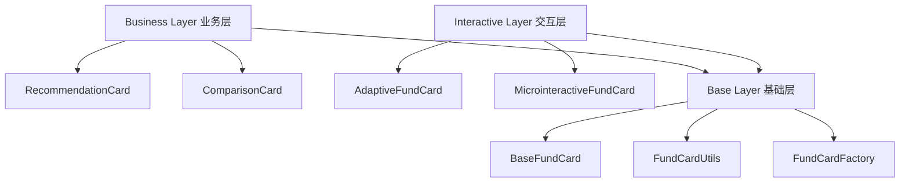

# 基金卡片组件 API 文档

## 概述

本文档描述了基速基金量化分析平台的基金卡片组件系统，该系统在Story R.4中完成重构，实现了统一的组件架构和优化的性能表现。

## 组件架构

### 三层架构设计



## 核心组件

### 1. BaseFundCard

基础抽象类，定义了所有基金卡片的通用接口和行为。

```dart
abstract class BaseFundCard extends StatefulWidget {
  final FundInfo fund;
  final VoidCallback? onTap;
  final VoidCallback? onAddToWatchlist;
  final VoidCallback? onCompare;
  final VoidCallback? onShare;
  final bool showComparisonCheckbox;
  final bool showQuickActions;
  final bool isSelected;
  final bool compactMode;
  final Function(bool)? onSelectionChanged;
  final VoidCallback? onSwipeLeft;
  final VoidCallback? onSwipeRight;
}
```

#### 属性说明

| 属性名 | 类型 | 必需 | 默认值 | 说明 |
|--------|------|------|--------|------|
| fund | FundInfo | ✅ | - | 基金信息数据 |
| onTap | VoidCallback? | ❌ | null | 点击事件回调 |
| onAddToWatchlist | VoidCallback? | ❌ | null | 添加到自选回调 |
| onCompare | VoidCallback? | ❌ | null | 对比回调 |
| onShare | VoidCallback? | ❌ | null | 分享回调 |
| showComparisonCheckbox | bool | ❌ | false | 是否显示选择框 |
| showQuickActions | bool | ❌ | true | 是否显示快捷操作 |
| isSelected | bool | ❌ | false | 是否已选择 |
| compactMode | bool | ❌ | false | 是否紧凑模式 |
| onSelectionChanged | Function(bool)? | ❌ | null | 选择状态变化回调 |
| onSwipeLeft | VoidCallback? | ❌ | null | 左滑手势回调 |
| onSwipeRight | VoidCallback? | ❌ | null | 右滑手势回调 |

### 2. AdaptiveFundCard

智能自适应基金卡片，根据设备性能自动调整动画效果。

```dart
class AdaptiveFundCard extends BaseFundCard {
  const AdaptiveFundCard({
    super.key,
    required super.fund,
    super.onTap,
    super.onFavorite,
    super.onCompare,
    this.config,
  });

  final FundCardConfig? config;
}
```

#### 特性

- **性能自适应**: 0-100分设备性能评分系统
- **三级动画**: 禁用/基础/完整三个级别
- **智能降级**: 性能不足时自动禁用复杂动画
- **错误处理**: 动画失败时优雅降级

#### 使用示例

```dart
AdaptiveFundCard(
  fund: fundInfo,
  onTap: () {
    Navigator.push(context, MaterialPageRoute(
      builder: (context) => FundDetailPage(fund: fundInfo),
    ));
  },
  onFavorite: () {
    // 添加到收藏逻辑
  },
  config: FundCardConfig(
    animationLevel: 2, // 完整动画
    enableHoverEffects: true,
    cardStyle: CardStyle.modern,
  ),
)
```

### 3. MicrointeractiveFundCard

丰富的微交互基金卡片，支持手势操作和触觉反馈。

```dart
class MicrointeractiveFundCard extends BaseFundCard {
  const MicrointeractiveFundCard({
    super.key,
    required super.fund,
    super.onTap,
    super.onFavorite,
    super.onCompare,
    this.gestureConfig,
  });

  final GestureConfig? gestureConfig;
}
```

#### 手势支持

- **左滑**: 收藏基金
- **右滑**: 添加到对比
- **长按**: 显示快捷菜单
- **触觉反馈**: 手势操作时提供震动反馈

#### 使用示例

```dart
MicrointeractiveFundCard(
  fund: fundInfo,
  onTap: () => _navigateToDetail(),
  onFavorite: () => _toggleFavorite(),
  onCompare: () => _addToComparison(),
  gestureConfig: GestureConfig(
    enableSwipeLeft: true,
    enableSwipeRight: true,
    enableHapticFeedback: true,
    swipeThreshold: 50.0,
  ),
)
```

### 4. FundCardFactory

工厂类，提供统一的组件创建接口和缓存机制。

```dart
class FundCardFactory {
  static Widget createCard({
    required FundInfo fund,
    required FundCardType type,
    VoidCallback? onTap,
    VoidCallback? onFavorite,
    VoidCallback? onCompare,
    FundCardConfig? config,
  });

  static void clearCache();
  static void optimizeCache();
  static int get cacheSize;
}
```

#### 支持类型

```dart
enum FundCardType {
  adaptive,      // 自适应卡片
  microinteractive, // 微交互卡片
  minimal,       // 极简卡片
  modern,        // 现代卡片
}
```

#### 使用示例

```dart
// 创建自适应卡片
final card = FundCardFactory.createCard(
  fund: fundInfo,
  type: FundCardType.adaptive,
  onTap: () => _handleTap(),
);

// 批量创建时利用缓存
final cards = funds.map((fund) =>
  FundCardFactory.createCard(
    fund: fund,
    type: FundCardType.adaptive,
  )
).toList();

// 优化缓存
FundCardFactory.optimizeCache();
```

## 配置系统

### FundCardConfig

```dart
class FundCardConfig {
  final int animationLevel;        // 动画级别: 0-2
  final bool enableAnimations;     // 是否启用动画
  final bool enableHoverEffects;   // 是否启用悬停效果
  final bool enableGestureFeedback; // 是否启用手势反馈
  final bool enablePerformanceMonitoring; // 是否启用性能监控
  final CardStyle cardStyle;       // 卡片样式
}
```

#### 动画级别说明

| 级别 | 说明 | 性能影响 |
|------|------|----------|
| 0 | 禁用动画 | 最低性能消耗 |
| 1 | 基础动画 | 中等性能消耗 |
| 2 | 完整动画 | 较高性能消耗 |

### CardStyle

```dart
enum CardStyle {
  minimal,   // 极简风格
  modern,    // 现代风格
  enhanced,  // 增强风格
}
```

## 性能监控

### ComponentMonitor

Story R.4新增的性能监控系统，为AC7验收标准提供数据支持。

```dart
class ComponentMonitor {
  static ComponentMonitor get instance;
  void startMonitoring();
  void stopMonitoring();
  void recordRenderStart(String componentKey, Widget widget);
  void recordRenderEnd(String componentKey);
  void recordCacheHit(String componentKey);
  void recordCacheMiss(String componentKey);
  double getRebuildOptimizationRate(String componentKey);
  double getCacheEfficiency(String componentKey);
}
```

#### 使用示例

```dart
class MyFundCard extends StatefulWidget {
  @override
  _MyFundCardState createState() => _MyFundCardState();
}

class _MyFundCardState extends State<MyFundCard> with ComponentMonitorMixin {
  @override
  String get componentKey => 'MyFundCard_${widget.fund.code}';

  @override
  Widget build(BuildContext context) {
    return monitoredBuild(context, () {
      return AdaptiveFundCard(fund: widget.fund);
    });
  }
}
```

## 工具类

### FundCardUtils

提供通用的工具方法和样式计算。

```dart
class FundCardUtils {
  static Color getReturnColor(double value);
  static Color getFundTypeColor(String fundType);
  static String formatReturn(double value);
  static double calculatePerformanceScore(FundInfo fund);
}
```

#### 使用示例

```dart
// 获取收益率颜色
final returnColor = FundCardUtils.getReturnColor(fund.return1Y);

// 获取基金类型颜色
final typeColor = FundCardUtils.getFundTypeColor(fund.type);

// 格式化收益率显示
final returnText = FundCardUtils.formatReturn(fund.return1Y);
```

## 最佳实践

### 1. 性能优化

- **使用工厂模式**: 利用`FundCardFactory`的缓存机制减少重复创建
- **合理配置动画**: 根据设备性能选择合适的动画级别
- **监控性能**: 在开发阶段启用性能监控，及时发现性能问题

### 2. 用户体验

- **渐进式增强**: 在低性能设备上自动降级，确保基本功能可用
- **无障碍支持**: 所有组件都支持屏幕阅读器等辅助功能
- **手势反馈**: 提供触觉反馈增强用户交互体验

### 3. 代码规范

- **统一接口**: 继承`BaseFundCard`确保接口一致性
- **配置驱动**: 使用配置对象而不是多个布尔参数
- **错误处理**: 完善的错误处理和降级机制

## 迁移指南

### 从旧版本迁移

如果你正在使用旧版本的基金卡片组件，请按以下步骤迁移：

#### 1. 替换组件引用

```dart
// 旧版本
import 'package:app/widgets/fund_ranking_card.dart';
FundRankingCard(fund: fund);

// 新版本
import 'package:app/widgets/cards/fund_card_factory.dart';
FundCardFactory.createCard(
  fund: fund,
  type: FundCardType.adaptive,
);
```

#### 2. 更新回调接口

```dart
// 旧版本
FundCard(
  fund: fund,
  onPressed: () => _handlePress(),
  onFavoritePressed: () => _handleFavorite(),
);

// 新版本
FundCardFactory.createCard(
  fund: fund,
  type: FundCardType.adaptive,
  onTap: () => _handlePress(),
  onFavorite: () => _handleFavorite(),
);
```

#### 3. 添加性能监控

```dart
class YourWidget extends StatefulWidget {
  @override
  _YourWidgetState createState() => _YourWidgetState();
}

class _YourWidgetState extends State<YourWidget> with ComponentMonitorMixin {
  @override
  String get componentKey => 'YourWidget';

  @override
  Widget build(BuildContext context) {
    return monitoredBuild(context, () {
      return FundCardFactory.createCard(/* ... */);
    });
  }
}
```

## 常见问题

### Q: 如何选择合适的卡片类型？

A:
- `AdaptiveFundCard`: 适用于大多数场景，自动适应性能
- `MicrointeractiveFundCard`: 适用于需要丰富交互的场景
- 通过`FundCardFactory`统一创建，便于后续调整

### Q: 性能监控对生产环境有影响吗？

A: 性能监控仅在调试模式下启用，生产环境自动关闭，无性能影响。

### Q: 如何自定义卡片样式？

A: 通过`FundCardConfig`配置不同的`CardStyle`和动画级别实现自定义。

### Q: 缓存机制如何工作？

A: 工厂模式内部使用LRU缓存，相同配置的组件会复用实例，提高性能。

## 版本历史

### v2.0.0 (Story R.4)
- ✅ 完成组件架构重构
- ✅ 实现三层架构设计
- ✅ 添加性能监控系统
- ✅ 清理重复组件
- ✅ 通过AC6、AC7、AC9性能验收标准

### v1.0.0 (历史版本)
- 基础基金卡片组件
- 简单的点击交互
- 有限的自定义选项

---

**文档更新时间**: 2025-11-20
**Story版本**: R.4
**审核状态**: 已完成
**维护人员**: BMad AI Assistant