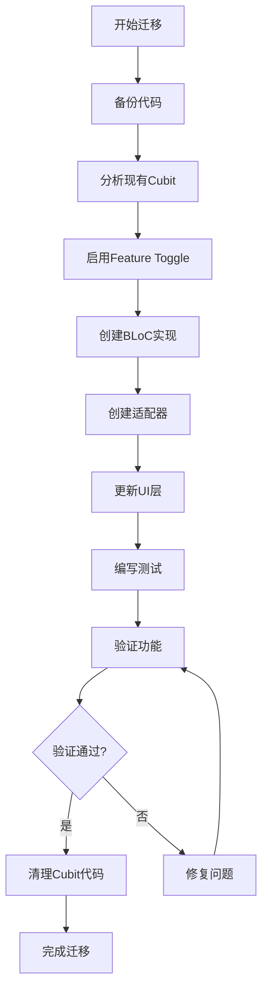

# 状态管理迁移指南

## 概述

本指南详细说明如何将现有的Cubit状态管理迁移到BLoC模式，以及如何使用新的状态管理统一化系统。

## 迁移前准备

### 环境检查

确保你的开发环境满足以下要求：

```bash
# 检查Flutter版本
flutter --version  # >= 3.13.0

# 检查依赖
flutter pub deps

# 运行测试确保当前功能正常
flutter test
```

### 代码备份

```bash
# 创建迁移前的备份分支
git checkout -b pre-migration-backup
git push -u origin pre-migration-backup

# 返回开发分支
git checkout master
```

## 迁移流程概览



## 第一步：分析现有Cubit

### 识别需要迁移的Cubit

使用以下命令查找所有Cubit：

```bash
# 查找所有Cubit文件
find lib -name "*cubit.dart" -type f

# 查找Cubit类定义
grep -r "class.*Cubit" lib/
```

### 分析Cubit复杂度

创建分析报告：

```dart
// migration_analysis.dart
class CubitAnalysis {
  final String name;
  final String filePath;
  final int linesOfCode;
  final int stateFields;
  final int methods;
  final bool hasComplexLogic;
  final List<String> dependencies;

  const CubitAnalysis({
    required this.name,
    required this.filePath,
    required this.linesOfCode,
    required this.stateFields,
    required this.methods,
    required this.hasComplexLogic,
    required this.dependencies,
  });

  /// 判断是否需要迁移到BLoC
  bool get shouldMigrateToBloc {
    return hasComplexLogic ||
           stateFields > 3 ||
           methods > 5 ||
           linesOfCode > 100;
  }
}
```

### 优先级评估

根据以下因素评估迁移优先级：

| 优先级 | 模块类型 | 理由 |
|--------|----------|------|
| 高 | alerts | 状态简单，风险低 |
| 中 | market | 中等复杂度，有明确边界 |
| 低 | fund | 复杂度高，需要仔细测试 |
| 极低 | portfolio | 核心功能，影响范围大 |

## 第二步：启用Feature Toggle

### 初始化特性开关

```dart
// 在应用启动时
void main() async {
  WidgetsFlutterBinding.ensureInitialized();

  // 初始化特性开关服务
  final featureToggle = FeatureToggleService.instance;

  // 检查是否需要启用迁移模式
  final migrationConfig = await loadMigrationConfig();
  if (migrationConfig.enableMigration) {
    featureToggle.switchMode(StateManagementMode.hybrid);
    featureToggle.enableBlocForModule('alerts'); // 从alerts模块开始
  }

  runApp(MyApp());
}
```

### 验证特性开关状态

```dart
// 调试工具：检查特性开关状态
void debugFeatureToggle() {
  final featureToggle = FeatureToggleService.instance;

  print('=== Feature Toggle Status ===');
  print('Current Mode: ${featureToggle.config.currentMode}');
  print('Migration Progress: ${featureToggle.getMigrationProgress()}');

  featureToggle.config.moduleToggles.forEach((module, enabled) {
    print('$module: ${enabled ? "BLoC" : "Cubit"}');
  });
}
```

## 第三步：创建BLoC实现

### 1. 分析Cubit状态

假设有以下Cubit：

```dart
// 原始Cubit
class FundSearchCubit extends Cubit<FundSearchState> {
  FundSearchCubit() : super(FundSearchState.initial());

  final List<Fund> _funds = [];
  bool _isLoading = false;
  String? _error;

  void searchFunds(String query) async {
    _isLoading = true;
    emit(FundSearchState.loading());

    try {
      final result = await _fundRepository.search(query);
      _funds = result;
      emit(FundSearchState.loaded(result));
    } catch (e) {
      _error = e.toString();
      emit(FundSearchState.error(e.toString()));
    } finally {
      _isLoading = false;
    }
  }

  void clearResults() {
    _funds.clear();
    emit(FundSearchState.initial());
  }
}
```

### 2. 创建Event类

```dart
// fund_search_event.dart
part of 'fund_search_bloc.dart';

abstract class FundSearchEvent extends Equatable {
  const FundSearchEvent();

  @override
  List<Object?> get props => [];
}

class FundSearchRequested extends FundSearchEvent {
  final String query;
  final int limit;

  const FundSearchRequested({
    required this.query,
    this.limit = 20,
  });

  @override
  List<Object?> get props => [query, limit];
}

class FundSearchClearResults extends FundSearchEvent {}

class FundSearchLoadMore extends FundSearchEvent {}
```

### 3. 创建State类

```dart
// fund_search_state.dart
part of 'fund_search_bloc.dart';

abstract class FundSearchState extends Equatable {
  const FundSearchState();

  @override
  List<Object?> get props => [];
}

class FundSearchInitial extends FundSearchState {}

class FundSearchLoading extends FundSearchState {
  final List<Fund> previousResults;

  const FundSearchLoading({this.previousResults = const []});

  @override
  List<Object?> get props => [previousResults];
}

class FundSearchLoaded extends FundSearchState {
  final List<Fund> results;
  final bool hasReachedMax;

  const FundSearchLoaded({
    required this.results,
    this.hasReachedMax = false,
  });

  @override
  List<Object?> get props => [results, hasReachedMax];
}

class FundSearchError extends FundSearchState {
  final String message;
  final List<Fund> previousResults;

  const FundSearchError({
    required this.message,
    this.previousResults = const [],
  });

  @override
  List<Object?> get props => [message, previousResults];
}
```

### 4. 创建BLoC类

```dart
// fund_search_bloc.dart
import 'package:bloc/bloc.dart';
import 'package:equatable/equatable.dart';

part 'fund_search_event.dart';
part 'fund_search_state.dart';

class FundSearchBloc extends Bloc<FundSearchEvent, FundSearchState> {
  final FundRepository _fundRepository;
  final AnalyticsService _analyticsService;

  FundSearchBloc({
    required FundRepository fundRepository,
    required AnalyticsService analyticsService,
  }) : _fundRepository = fundRepository,
       _analyticsService = analyticsService,
       super(FundSearchInitial()) {
    on<FundSearchRequested>(_onSearchRequested);
    on<FundSearchClearResults>(_onClearResults);
    on<FundSearchLoadMore>(_onLoadMore);
  }

  Future<void> _onSearchRequested(
    FundSearchRequested event,
    Emitter<FundSearchState> emit,
  ) async {
    emit(FundSearchLoading());

    try {
      final results = await _fundRepository.search(
        event.query,
        limit: event.limit,
      );

      await _analyticsService.trackSearch(event.query, results.length);

      emit(FundSearchLoaded(
        results: results,
        hasReachedMax: results.length < event.limit,
      ));
    } catch (e) {
      AppLogger.error('基金搜索失败', e);
      emit(FundSearchError(message: e.toString()));
    }
  }

  void _onClearResults(
    FundSearchClearResults event,
    Emitter<FundSearchState> emit,
  ) {
    emit(FundSearchInitial());
  }

  Future<void> _onLoadMore(
    FundSearchLoadMore event,
    Emitter<FundSearchState> emit,
  ) async {
    final currentState = state;
    if (currentState is FundSearchLoaded && !currentState.hasReachedMax) {
      emit(FundSearchLoading(previousResults: currentState.results));

      try {
        final additionalResults = await _fundRepository.search(
          lastQuery, // 需要保存上次查询
          offset: currentState.results.length,
        );

        final allResults = [...currentState.results, ...additionalResults];
        final hasReachedMax = additionalResults.isEmpty;

        emit(FundSearchLoaded(
          results: allResults,
          hasReachedMax: hasReachedMax,
        ));
      } catch (e) {
        AppLogger.error('加载更多基金失败', e);
        emit(FundSearchError(
          message: e.toString(),
          previousResults: currentState.results,
        ));
      }
    }
  }
}
```

## 第四步：创建适配器

### 适配器模式实现

```dart
// fund_search_adapter.dart
class FundSearchAdapter {
  const FundSearchAdapter._();

  static Widget create({
    required Widget Function(BuildContext context) builder,
  }) {
    return Builder(
      builder: (context) {
        final featureToggle = FeatureToggleService.instance;
        final useBloc = featureToggle.useBlocMode('fund');

        if (useBloc) {
          debugPrint('🔄 FundSearchAdapter: 使用BLoC模式');
          return BlocProvider(
            create: (context) => FundSearchBloc(
              fundRepository: sl<FundRepository>(),
              analyticsService: sl<AnalyticsService>(),
            ),
            child: Builder(builder: builder),
          );
        } else {
          debugPrint('🔄 FundSearchAdapter: 使用Cubit模式');
          return BlocProvider(
            create: (context) => sl<FundSearchCubit>(),
            child: Builder(builder: builder),
          );
        }
      },
    );
  }

  static void addEvent(BuildContext context, dynamic event) {
    final featureToggle = FeatureToggleService.instance;
    final useBloc = featureToggle.useBlocMode('fund');

    if (useBloc) {
      context.read<FundSearchBloc>().add(event);
    } else {
      // Cubit模式，直接调用方法
      if (event is FundSearchRequested) {
        context.read<FundSearchCubit>().searchFunds(event.query);
      } else if (event is FundSearchClearResults) {
        context.read<FundSearchCubit>().clearResults();
      }
    }
  }

  static dynamic getState(BuildContext context) {
    final featureToggle = FeatureToggleService.instance;
    final useBloc = featureToggle.useBlocMode('fund');

    if (useBloc) {
      return context.watch<FundSearchBloc>().state;
    } else {
      return context.watch<FundSearchCubit>().state;
    }
  }
}
```

### 状态适配器

```dart
// fund_search_state_adapter.dart
class FundSearchStateAdapter {
  const FundSearchStateAdapter._();

  static bool isLoading(BuildContext context) {
    final state = FundSearchAdapter.getState(context);
    return state is FundSearchLoading ||
           (state is FundSearchState && state.isLoading);
  }

  static List<Fund> getResults(BuildContext context) {
    final state = FundSearchAdapter.getState(context);
    if (state is FundSearchLoaded) {
      return state.results;
    } else if (state is FundSearchState) {
      return state.results;
    }
    return [];
  }

  static String? getError(BuildContext context) {
    final state = FundSearchAdapter.getState(context);
    if (state is FundSearchError) {
      return state.message;
    } else if (state is FundSearchState) {
      return state.error;
    }
    return null;
  }

  static bool isInitial(BuildContext context) {
    final state = FundSearchAdapter.getState(context);
    return state is FundSearchInitial ||
           (state is FundSearchState && state.results.isEmpty && !state.isLoading);
  }
}
```

## 第五步：更新UI层

### 使用适配器重构UI

```dart
// fund_search_page.dart
class FundSearchPage extends StatelessWidget {
  const FundSearchPage({Key? key}) : super(key: key);

  @override
  Widget build(BuildContext context) {
    return FundSearchAdapter.create(
      builder: (context) => Scaffold(
        appBar: AppBar(
          title: const Text('基金搜索'),
        ),
        body: Column(
          children: [
            _buildSearchBar(context),
            Expanded(child: _buildResults(context)),
          ],
        ),
      ),
    );
  }

  Widget _buildSearchBar(BuildContext context) {
    return Padding(
      padding: const EdgeInsets.all(16),
      child: TextField(
        decoration: const InputDecoration(
          labelText: '搜索基金',
          suffixIcon: Icon(Icons.search),
        ),
        onChanged: (query) {
          if (query.isNotEmpty) {
            FundSearchAdapter.addEvent(
              context,
              FundSearchRequested(query: query),
            );
          }
        },
      ),
    );
  }

  Widget _buildResults(BuildContext context) {
    final isLoading = FundSearchStateAdapter.isLoading(context);
    final results = FundSearchStateAdapter.getResults(context);
    final error = FundSearchStateAdapter.getError(context);

    if (isLoading) {
      return const Center(child: CircularProgressIndicator());
    }

    if (error != null) {
      return Center(
        child: Text('搜索失败: $error'),
      );
    }

    if (results.isEmpty && !FundSearchStateAdapter.isInitial(context)) {
      return const Center(
        child: Text('未找到匹配的基金'),
      );
    }

    return ListView.builder(
      itemCount: results.length,
      itemBuilder: (context, index) {
        final fund = results[index];
        return FundCard(fund: fund);
      },
    );
  }
}
```

## 第六步：编写测试

### BLoC测试

```dart
// fund_search_bloc_test.dart
void main() {
  group('FundSearchBloc', () {
    late MockFundRepository mockRepository;
    late MockAnalyticsService mockAnalytics;
    late FundSearchBloc fundSearchBloc;

    setUp(() {
      mockRepository = MockFundRepository();
      mockAnalytics = MockAnalyticsService();
      fundSearchBloc = FundSearchBloc(
        fundRepository: mockRepository,
        analyticsService: mockAnalytics,
      );
    });

    tearDown(() {
      fundSearchBloc.close();
    });

    blocTest<FundSearchBloc, FundSearchState>(
      '初始状态是FundSearchInitial',
      build: () => fundSearchBloc,
      expect: () => [FundSearchInitial()],
    );

    blocTest<FundSearchBloc, FundSearchState>(
      '搜索成功时发出FundSearchLoaded',
      build: () => fundSearchBloc,
      act: (bloc) => bloc.add(FundSearchRequested(query: '基金')),
      setUp: () {
        when(mockRepository.search(any, limit: anyNamed('limit')))
            .thenAnswer((_) async => mockFunds);
      },
      expect: () => [
        FundSearchLoading(),
        FundSearchLoaded(results: mockFunds),
      ],
      verify: (_) {
        verify(mockRepository.search('基金', limit: 20)).called(1);
        verify(mockAnalytics.trackSearch('基金', mockFunds.length)).called(1);
      },
    );

    blocTest<FundSearchBloc, FundSearchState>(
      '搜索失败时发出FundSearchError',
      build: () => fundSearchBloc,
      act: (bloc) => bloc.add(FundSearchRequested(query: '基金')),
      setUp: () {
        when(mockRepository.search(any, limit: anyNamed('limit')))
            .thenThrow(Exception('网络错误'));
      },
      expect: () => [
        FundSearchLoading(),
        FundSearchError(message: 'Exception: 网络错误'),
      ],
    );
  });
}
```

### 适配器测试

```dart
// fund_search_adapter_test.dart
void main() {
  group('FundSearchAdapter', () {
    late FeatureToggleService featureToggle;

    setUp(() {
      featureToggle = FeatureToggleService.instance;
      featureToggle.resetToDefault();
    });

    testWidgets('在Cubit模式下使用Cubit', (WidgetTester tester) async {
      featureToggle.switchMode(StateManagementMode.cubit);

      await tester.pumpWidget(
        MaterialApp(
          home: FundSearchAdapter.create(
            builder: (context) => const Scaffold(
              body: Text('Test Widget'),
            ),
          ),
        ),
      );

      expect(find.text('Test Widget'), findsOneWidget);
      expect(find.byType(FundSearchCubit), findsOneWidget);
    });

    testWidgets('在BLoC模式下使用BLoC', (WidgetTester tester) async {
      featureToggle.switchMode(StateManagementMode.hybrid);
      featureToggle.enableBlocForModule('fund');

      await tester.pumpWidget(
        MaterialApp(
          home: FundSearchAdapter.create(
            builder: (context) => const Scaffold(
              body: Text('Test Widget'),
            ),
          ),
        ),
      );

      expect(find.text('Test Widget'), findsOneWidget);
      expect(find.byType(FundSearchBloc), findsOneWidget);
    });
  });
}
```

## 第七步：验证功能

### 功能验证清单

- [ ] UI显示正常
- [ ] 搜索功能工作
- [ ] 错误处理正确
- [ ] 性能无明显下降
- [ ] 日志记录正常
- [ ] 测试通过

### 测试运行

```bash
# 运行所有测试
flutter test

# 运行特定测试
flutter test test/unit/fund_search/

# 运行集成测试
flutter test test/integration/fund_search_integration_test.dart

# 运行覆盖率测试
flutter test --coverage
```

### 手动测试

1. **基本功能测试**
   - 输入搜索关键词
   - 验证搜索结果显示
   - 测试清空功能

2. **错误处理测试**
   - 网络断开时搜索
   - 空搜索词处理
   - 服务器错误处理

3. **性能测试**
   - 大量搜索结果处理
   - 频繁搜索操作
   - 内存使用情况

4. **Feature Toggle测试**
   - 切换模式验证
   - 状态保持测试
   - 迁移过程测试

## 第八步：清理代码

### 移除Cubit代码

```bash
# 备份Cubit文件（以防需要回滚）
git mv lib/src/features/fund/presentation/cubit/fund_search_cubit.dart \
       lib/src/features/fund/presentation/cubit/fund_search_cubit.dart.bak

# 更新依赖注入容器
# 移除Cubit注册，添加BLoC注册
```

### 更新文档

```dart
// 更新README.md
## 状态管理

本项目使用BLoC模式进行状态管理。详细信息请参考：
- [状态管理架构文档](../docs/architecture/state-management-unification.md)
- [状态管理开发规范](../docs/development/state-management-guidelines.md)
```

### 提交代码

```bash
# 提交迁移代码
git add .
git commit -m "feat: 迁移fund搜索模块到BLoC模式

- 创建FundSearchBloc替换FundSearchCubit
- 实现Feature Toggle支持
- 添加适配器模式保证向后兼容
- 添加完整的测试覆盖
- 更新相关文档

🤖 Generated with Claude Code

Co-Authored-By: Claude <noreply@anthropic.com>"

# 推送到远程仓库
git push origin feature/fund-search-bloc-migration
```

## 故障排除

### 常见问题

#### 1. BLoC事件不触发

```dart
// 检查BLoC是否正确注册
final bloc = context.read<FundSearchBloc>();
if (bloc.isClosed) {
  print('BLoC已关闭');
}

// 检查事件是否正确添加
bloc.add(FundSearchRequested(query: 'test'));
print('事件已添加');
```

#### 2. 状态不更新

```dart
// 检查状态监听
context.select<FundSearchBloc, FundSearchState>(
  (bloc) => bloc.state,
  (state) {
    print('状态更新: $state');
  },
);
```

#### 3. Feature Toggle不工作

```dart
// 检查特性开关状态
final featureToggle = FeatureToggleService.instance;
print('当前模式: ${featureToggle.config.currentMode}');
print('fund模块使用BLoC: ${featureToggle.useBlocMode('fund')}');
```

### 回滚策略

如果迁移过程中出现问题，可以使用以下回滚策略：

```bash
# 回滚到Cubit模式
git checkout HEAD~1 -- lib/src/features/fund/presentation/cubit/
git checkout HEAD~1 -- lib/src/features/fund/presentation/pages/

# 更新Feature Toggle
featureToggle.disableBlocForModule('fund');

# 重新提交
git add .
git commit -m "revert: 回滚fund搜索模块到Cubit模式"
```

## 迁移后续工作

### 监控和优化

1. **性能监控**
   - 监控BLoC的性能指标
   - 比较迁移前后的性能差异
   - 优化热路径代码

2. **错误监控**
   - 监控BLoC的错误率
   - 设置错误报警机制
   - 及时修复发现的问题

3. **用户反馈**
   - 收集用户对新功能的反馈
   - 分析用户行为数据
   - 持续优化用户体验

### 团队培训

1. **技术培训**
   - 组织BLoC模式培训
   - 分享迁移经验和最佳实践
   - 建立代码审查规范

2. **文档维护**
   - 及时更新技术文档
   - 维护FAQ页面
   - 分享问题解决方案

## 参考资料

- [BLoC官方文档](https://bloclibrary.dev/)
- [Flutter状态管理最佳实践](https://docs.flutter.dev/development/data-and-backend/state-mgmt)
- [特性开关模式](https://martinfowler.com/articles/feature-toggles.html)

---

**文档维护**: 开发团队
**最后更新**: 2025-11-17
**版本**: 1.0.0