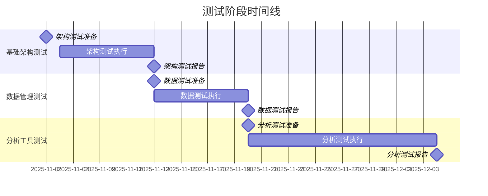

# QA测试文档索引

## 📋 测试文档导航

欢迎来到基速基金量化分析平台的质量保证(QA)测试文档索引页面。本文档提供了完整的测试体系概览和导航信息。

---

## 🎯 质量保证体系概览

### 质量目标

- **功能正确性**: 核心功能正确率 ≥ 99.5%
- **性能指标**: 响应时间满足设计要求
- **稳定性**: 系统可用性 ≥ 99.9%
- **安全性**: 无高危安全漏洞
- **用户体验**: 用户满意度 ≥ 4.5/5.0

### 测试策略

采用金字塔测试策略，分层进行质量保证：

```
    E2E测试 (5%)
   ┌─────────────┐
  │ 用户验收测试 │
   └─────────────┘
集成测试 (25%)
 ┌───────────────────┐
│  接口测试  │
│  组件测试  │
 └───────────────────┘
单元测试 (70%)
┌─────────────────────────┐
│ 函数/方法测试  │
│ 模块/类测试   │
└─────────────────────────┘
```

---

## 📚 核心测试文档

### 📖 主测试文档
- **[测试文档](./测试文档.md)** - 完整的QA测试体系说明

**包含内容**:
- 质量目标和标准
- 测试策略和计划
- 测试工具和框架
- 质量度量指标
- 缺陷管理流程

---

### 📋 测试计划文档

#### 总体测试计划
- **[总体测试计划](./test-plan/master-test-plan.md)** - 项目整体测试策略
- **状态**: ✅ 已创建
- **更新频率**: 每个Sprint更新

#### 史诗测试计划
- **[EPIC-001测试计划](./test-plan/epic-test-plans/EPIC-001-基础架构测试计划.md)** - 基础架构测试
- **[EPIC-002测试计划](./test-plan/epic-test-plans/EPIC-002-基金数据管理测试计划.md)** - 基金数据管理测试
- **其他史诗测试计划** - 待创建

#### Sprint测试计划
- Sprint 1 测试计划 - 待创建
- Sprint 2 测试计划 - 待创建
- Sprint N 测试计划 - 待创建

---

### 🧪 测试用例文档

#### 单元测试用例
- **[基础架构单元测试](./test-cases/unit-tests/基础架构单元测试用例.md)** - EPIC-001单元测试
- **[数据管理单元测试](./test-cases/unit-tests/数据管理单元测试用例.md)** - EPIC-002单元测试
- **其他模块单元测试** - 待创建

#### 集成测试用例
- **[API集成测试](./test-cases/integration-tests/API集成测试用例.md)** - API接口测试
- **[数据库集成测试](./test-cases/integration-tests/数据库集成测试用例.md)** - 数据库测试
- **[服务集成测试](./test-cases/integration-tests/服务集成测试用例.md)** - 服务间集成测试

#### 系统测试用例
- **[功能测试用例](./test-cases/system-tests/功能测试用例.md)** - 系统功能测试
- **[性能测试用例](./test-cases/system-tests/性能测试用例.md)** - 性能测试
- **[安全测试用例](./test-cases/system-tests/安全测试用例.md)** - 安全测试
- **[兼容性测试用例](./test-cases/system-tests/兼容性测试用例.md)** - 兼容性测试

#### 用户验收测试用例
- **[业务场景测试](./test-cases/uat-tests/业务场景测试用例.md)** - 用户业务场景
- **[用户体验测试](./test-cases/uat-tests/用户体验测试用例.md)** - 用户体验测试
- **[可访问性测试](./test-cases/uat-tests/可访问性测试用例.md)** - 无障碍测试

---

### 📊 测试报告文档

#### 日常报告
- **[测试日报模板](./test-reports/daily-reports/测试日报模板.md)** - 每日测试报告
- **日报存档** - 历史日报记录

#### 周期报告
- **[测试周报模板](./test-reports/weekly-reports/测试周报模板.md)** - 每周测试报告
- **[月度质量报告](./test-reports/weekly-reports/月度质量报告.md)** - 月度质量总结

#### 里程碑报告
- **[阶段测试报告](./test-reports/milestone-reports/阶段测试报告.md)** - 里程碑测试总结
- **[发布质量报告](./test-reports/milestone-reports/发布质量报告.md)** - 发布质量评估

---

### 🔧 测试自动化文档

#### 测试框架
- **[Flutter单元测试框架](./test-automation/frameworks/Flutter单元测试框架.md)** - Flutter测试框架
- **[集成测试框架](./test-automation/frameworks/集成测试框架.md)** - 集成测试框架
- **[UI自动化框架](./test-automation/frameworks/UI自动化测试框架.md)** - UI自动化框架

#### 测试脚本
- **[API测试脚本](./test-automation/scripts/API测试脚本.md)** - API自动化测试
- **[性能测试脚本](./test-automation/scripts/性能测试脚本.md)** - 性能自动化测试
- **[回归测试脚本](./test-automation/scripts/回归测试脚本.md)** - 回归自动化测试

#### 配置文件
- **[测试环境配置](./test-automation/configs/测试环境配置.md)** - 测试环境设置
- **[测试数据配置](./test-automation/configs/测试数据配置.md)** - 测试数据管理
- **[CI/CD集成配置](./test-automation/configs/CICD集成配置.md)** - 持续集成配置

---

### 📏 质量标准文档

#### 代码质量标准
- **[代码质量标准](./quality-standards/code-quality.md)** - 代码质量要求
- **[静态分析规则](./quality-standards/静态分析规则.md)** - 静态代码分析
- **[代码审查标准](./quality-standards/代码审查标准.md)** - 代码审查规范

#### 性能标准
- **[性能测试标准](./quality-standards/performance.md)** - 性能基准和指标
- **[性能监控标准](./quality-standards/性能监控.md)** - 性能监控规范
- **[性能优化指南](./quality-standards/性能优化指南.md)** - 性能优化建议

#### 安全标准
- **[安全测试标准](./quality-standards/security.md)** - 安全测试要求
- **[安全合规检查](./quality-standards/安全合规检查.md)** - 安全合规规范
- **[数据保护标准](./quality-standards/数据保护.md)** - 数据保护要求

---

## 📈 测试阶段规划

### 当前测试阶段

```yaml
阶段1: 基础架构测试 (进行中)
  时间: EPIC-001开发周期中
  范围: Flutter框架、状态管理、网络通信、数据存储
  重点: 技术架构稳定性
  状态: ✅ 计划完成

阶段2: 数据管理测试 (计划中)
  时间: EPIC-002开发完成后
  范围: 基金信息展示、搜索筛选、数据准确性
  重点: 功能正确性和用户体验
  状态: ⏳ 计划中

阶段3: 分析工具测试 (计划中)
  时间: EPIC-003开发完成后
  范围: 技术指标、风险评估、收益分析
  重点: 计算准确性和数据可视化
  状态: ⏳ 计划中
```

### 测试里程碑



---

## 🔍 测试工具和框架

### 自动化测试工具栈

```yaml
Flutter测试:
  单元测试: flutter_test
  集成测试: integration_test
  Widget测试: flutter_test
  Golden测试: golden_toolkit

API测试:
  HTTP Mock: mockito
  API测试: http_mock_adapter
  响应验证: json_matcher

性能测试:
  性能分析: Flutter Performance
  内存监控: dart:developer
  CPU监控: Flutter DevTools
  网络监控: Dio拦截器

自动化框架:
  CI/CD: GitHub Actions
  测试管理: TestRail
  报告生成: Allure Report
```

### 测试数据管理

```yaml
测试数据生成:
  基础数据: 预定义测试数据集
  动态数据: Faker + 自定义生成器
  边界数据: 极值和边界值数据
  异常数据: 错误场景数据

数据管理策略:
  数据隔离: 测试用例间数据独立
  数据版本: 测试数据版本管理
  数据清理: 测试后自动清理
  数据同步: 环境间数据同步
```

---

## 🎯 质量指标

### 当前质量状态

```yaml
代码质量:
  单元测试覆盖率: 目标 80%, 当前 0%
  集成测试覆盖率: 目标 90%, 当前 0%
  静态分析通过率: 目标 100%, 当前 N/A
  代码规范遵循率: 目标 100%, 当前 N/A

测试质量:
  测试用例通过率: 目标 95%, 当前 N/A
  自动化测试率: 目标 80%, 当前 0%
  缺陷发现率: 持续跟踪
  缺陷修复率: 目标 95%, 当前 N/A

性能质量:
  响应时间达标率: 目标 100%, 当前 N/A
  资源使用率: 目标 ≤ 70%, 当前 N/A
  并发处理能力: 目标 ≥ 5000 req/s, 当前 N/A
  系统稳定性: 目标 ≥ 99.9%, 当前 N/A
```

### 质量趋势监控

```yaml
监控指标:
  测试执行趋势: 每周跟踪
  缺陷发现趋势: 每周跟踪
  代码质量趋势: 每Sprint跟踪
  性能指标趋势: 每发布跟踪

报告机制:
  日报: 测试执行情况
  周报: 质量趋势分析
  月报: 质量目标达成
  季报: 质量改进计划
```

---

## 🚨 缺陷管理

### 缺陷状态跟踪

```yaml
当前缺陷状态:
  总缺陷数: 0 (项目初期)
  Blocker: 0
  Critical: 0
  Major: 0
  Minor: 0

缺陷处理流程:
  发现 → 报告 → 确认 → 分配 → 修复 → 验证 → 关闭

缺陷趋势:
  新增缺陷: 持续跟踪
  修复缺陷: 持续跟踪
  平均修复时间: 目标 ≤ 2天
  缺陷密度: 持续监控
```

### 缺陷预防措施

```yaml
预防策略:
  代码审查: 100%代码覆盖率
  静态分析: 自动化代码检查
  测试用例: 全面的测试覆盖
  质量门禁: 严格的质量控制

改进措施:
  根因分析: 深入分析缺陷原因
  流程优化: 持续优化开发流程
  技能提升: 团队能力建设
  工具改进: 测试工具和框架优化
```

---

## 🔄 持续集成

### CI/CD测试集成

```yaml
自动化流水线:
  代码提交: 触发自动化测试
  构建阶段: 单元测试 + 静态分析
  测试阶段: 集成测试 + 系统测试
  部署阶段: 部署测试 + 冒烟测试

质量门禁:
  单元测试通过率: 100%
  集成测试通过率: 100%
  静态分析无错误: 100%
  性能基准达标: 100%
  安全扫描无高危: 100%
```

### 测试环境管理

```yaml
环境配置:
  开发环境: 本地开发测试
  测试环境: QA功能测试
  预生产环境: 用户验收测试
  生产环境: 生产监控测试

环境管理:
  配置统一: 环境配置标准化
  数据一致: 测试数据管理
  版本控制: 环境版本管理
  监控告警: 环境状态监控
```

---

## 🔗 相关文档链接

### 产品相关文档
- **[PRD产品需求文档](../prd.md)** - 产品需求和功能定义
- **[用户故事文档](../stories/)** - 用户故事和验收标准
- **[架构设计文档](../architecture/)** - 系统技术架构

### 开发相关文档
- **[API接口文档](../api/)** - 接口规范和数据格式
- **[开发环境配置](../development/)** - 开发环境搭建指南
- **[代码规范文档](../development/code-style.md)** - 代码编写规范

### 运维相关文档
- **[部署文档](../deployment/)** - 系统部署指南
- **[监控文档](../monitoring/)** - 系统监控配置
- **[运维手册](../operations/)** - 运维操作手册

---

## 👥 团队协作

### 测试团队角色

```yaml
角色分工:
  测试经理: 测试策略制定、团队管理、质量把控
  功能测试工程师: 功能测试、用例设计、缺陷验证
  自动化测试工程师: 自动化框架、脚本开发、CI/CD集成
  性能测试工程师: 性能测试、性能分析、优化建议
  安全测试工程师: 安全测试、漏洞扫描、合规检查

协作方式:
  每日站会: 同步测试进度和问题
  周例会议: 回顾本周测试情况
  里程碑会议: 评估阶段测试成果
  培训分享: 技能提升和经验分享
```

### 沟通机制

```yaml
内部沟通:
  测试团队: 每日站会、周例会
  开发团队: 缺陷沟通、技术讨论
  产品团队: 需求确认、验收沟通
  项目团队: 项目进度、风险评估

外部沟通:
  用户反馈: 收集用户测试反馈
  第三方测试: 外部测试机构协调
  监管沟通: 合规测试沟通
  供应商沟通: 测试工具和设备
```

---

## 📞 联系方式

### 测试团队联系

```yaml
测试负责人: [测试经理姓名]
邮箱: [测试经理邮箱]
电话: [测试经理电话]

紧急联系:
  生产问题: [紧急联系人]
  安全事件: [安全负责人]
  性能问题: [性能负责人]

常规咨询:
  测试流程: [测试工程师]
  工具使用: [自动化工程师]
  报告查看: [测试助理]
```

---

## 📝 文档维护

### 维护信息

- **文档版本**: v1.0
- **创建时间**: 2025-10-30
- **最后更新**: 2025-10-30
- **维护团队**: QA测试团队
- **更新频率**: 每个Sprint结束后更新

### 更新记录

```yaml
v1.0 (2025-10-30):
  - 创建QA测试文档索引
  - 建立测试文档结构
  - 制定测试策略和标准
  - 规划测试阶段和里程碑

后续更新:
  - 测试计划文档创建
  - 测试用例文档编写
  - 测试报告模板制定
  - 质量标准文档完善
```

---

*本文档将随着项目进展持续更新，确保与项目实际测试进度保持同步。如有任何问题或建议，请及时反馈给QA测试团队。*