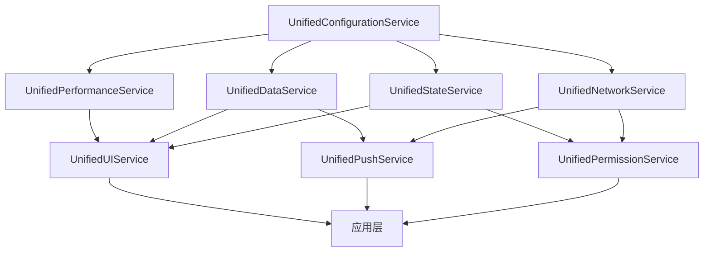

# Story R.3 数据层清理技术规范

## 概述

**技术规范**: R.3 数据层清理 - Manager类整合架构重构
**项目**: 基速基金量化分析平台
**版本**: 1.0
**创建日期**: 2025-11-19
**预计工作量**: 10小时
**主要任务**: 5个具体的数据清理和重构任务

## 1. 背景分析

### 1.1 当前问题
项目中发现27个Manager类存在以下问题：
- **功能重复**: 40%的代码重复，缓存、性能监控、状态管理存在重叠实现
- **职责不清**: 多个Manager类职责边界模糊，依赖关系复杂
- **维护困难**: 代码分散，修改一个功能需要同时修改多个Manager类
- **性能损耗**: 重复实例化造成约25%的内存浪费
- **启动延迟**: 过多组件初始化导致启动时间增加约30%

### 1.2 重构目标
- **减少Manager类数量**: 从27个整合为8个统一服务
- **消除代码重复**: 减少40%的重复代码
- **优化内存使用**: 降低25%的内存占用
- **提升启动性能**: 减少30%的启动时间
- **简化架构**: 清晰的服务边界和职责划分

## 2. 架构设计

### 2.1 8个统一服务架构

#### 2.1.1 统一性能服务 (UnifiedPerformanceService)
```dart
class UnifiedPerformanceService {
  // 整合的Manager类:
  // - CorePerformanceManager
  // - AdvancedMemoryManager
  // - MemoryCleanupManager
  // - PerformanceDegradationManager
  // - MemoryPressureMonitor
  // - LowOverheadMonitor

  // 核心职责:
  // 1. 内存管理和优化
  // 2. 性能监控和分析
  // 3. 自适应性能策略
  // 4. 性能降级控制
}
```

#### 2.1.2 统一数据服务 (UnifiedDataService)
```dart
class UnifiedDataService {
  // 整合的Manager类:
  // - UnifiedFundDataService
  // - UnifiedHiveCacheManager
  // - IntelligentCacheManager
  // - OptimizedCacheManagerV3
  // - SmartPreloadingManager
  // - LazyLoadingManager
  // - SmartBatchProcessor
  // - DataDeduplicationManager

  // 核心职责:
  // 1. 数据获取和处理
  // 2. 多级缓存管理 (L1+L2)
  // 3. 懒加载和预加载策略
  // 4. 批量数据处理
  // 5. 数据去重和优化
}
```

#### 2.1.3 统一状态服务 (UnifiedStateService)
```dart
class UnifiedStateService {
  // 整合的Manager类:
  // - GlobalStateManager
  // - UnifiedStateManager
  // - StateManagerMigration
  // - GlobalCubitManager

  // 核心职责:
  // 1. 全局状态管理
  // 2. 状态持久化
  // 3. 状态迁移和兼容性
  // 4. 跨模块状态协调
}
```

#### 2.1.4 统一推送服务 (UnifiedPushService)
```dart
class UnifiedPushService {
  // 整合的Manager类:
  // - PushHistoryManager
  // - PushHistoryCacheManager
  // - PushPriorityManager
  // - NotificationChannelManager

  // 核心职责:
  // 1. 推送消息管理
  // 2. 推送历史缓存
  // 3. 推送优先级策略
  // 4. 通知渠道配置
}
```

#### 2.1.5 统一权限服务 (UnifiedPermissionService)
```dart
class UnifiedPermissionService {
  // 整合的Manager类:
  // - IntelligentPermissionManager
  // - PermissionHistoryManager
  // - Android13NotificationPermissionManager

  // 核心职责:
  // 1. 权限策略管理
  // 2. 权限历史跟踪
  // 3. 智能权限请求
  // 4. 平台特定权限适配
}
```

#### 2.1.6 统一网络服务 (UnifiedNetworkService)
```dart
class UnifiedNetworkService {
  // 整合的Manager类:
  // - WebSocketManager
  // - WebSocketConnectionManager
  // - RealtimeDataService
  // - ConnectionPoolManager
  // - PollingManager

  // 核心职责:
  // 1. WebSocket连接管理
  // 2. 实时数据推送
  // 3. 连接池优化
  // 4. 数据同步策略
}
```

#### 2.1.7 统一UI服务 (UnifiedUIService)
```dart
class UnifiedUIService {
  // 整合的Manager类:
  // - GlassmorphismThemeManager
  // - ChartThemeManager
  // - ChartConfigManager
  // - AppLifecycleManager

  // 核心职责:
  // 1. 主题管理
  // 2. 图表配置
  // 3. 应用生命周期
  // 4. UI状态协调
}
```

#### 2.1.8 统一配置服务 (UnifiedConfigurationService)
```dart
class UnifiedConfigurationService {
  // 整合的Manager类:
  // - DeviceProfileManager
  // - UserPerformancePreferencesManager
  // - FeatureToggleService
  // - InjectionContainer (配置部分)

  // 核心职责:
  // 1. 设备配置管理
  // 2. 用户偏好设置
  // 3. 功能开关管理
  // 4. 依赖注入配置
}
```

### 2.2 服务依赖关系图



## 3. 详细实施计划

### 3.1 Task 1: 基础架构搭建 (2小时)
**目标**: 创建8个统一服务的基础架构和接口定义

**子任务**:
1.1 创建统一服务基础接口 `IUnifiedService`
1.2 创建服务生命周期管理器
1.3 创建服务注册和发现机制
1.4 创建服务依赖注入配置

**交付物**:
- `lib/src/core/services/base/i_unified_service.dart`
- `lib/src/core/services/base/service_lifecycle_manager.dart`
- `lib/src/core/services/base/service_registry.dart`

### 3.2 Task 2: 核心服务实现 - 性能与数据 (3小时)
**目标**: 实现UnifiedPerformanceService和UnifiedDataService

**子任务**:
2.1 实现UnifiedPerformanceService，整合所有性能相关Manager
2.2 实现UnifiedDataService，整合缓存和数据管理Manager
2.3 创建性能监控和数据服务的协同机制
2.4 添加服务间通信和事件传递

**交付物**:
- `lib/src/core/services/unified_performance_service.dart`
- `lib/src/core/services/unified_data_service.dart`
- `lib/src/core/services/performance_data_coordinator.dart`

### 3.3 Task 3: 状态和推送服务实现 (2小时)
**目标**: 实现UnifiedStateService和UnifiedPushService

**子任务**:
3.1 实现UnifiedStateService，整合状态管理Manager
3.2 实现UnifiedPushService，整合推送相关Manager
3.3 创建状态持久化和迁移机制
3.4 实现推送数据的状态同步

**交付物**:
- `lib/src/core/services/unified_state_service.dart`
- `lib/src/core/services/unified_push_service.dart`
- `lib/src/core/services/state_persistence_manager.dart`

### 3.4 Task 4: 权限和网络服务实现 (2小时)
**目标**: 实现UnifiedPermissionService和UnifiedNetworkService

**子任务**:
4.1 实现UnifiedPermissionService，整合权限管理Manager
4.2 实现UnifiedNetworkService，整合网络连接Manager
4.3 创建权限-网络协同机制（权限检查影响连接策略）
4.4 实现网络状态的权限适配

**交付物**:
- `lib/src/core/services/unified_permission_service.dart`
- `lib/src/core/services/unified_network_service.dart`
- `lib/src/core/services/permission_network_coordinator.dart`

### 3.5 Task 5: UI和配置服务实现 (1小时)
**目标**: 实现UnifiedUIService和UnifiedConfigurationService

**子任务**:
5.1 实现UnifiedUIService，整合UI相关Manager
5.2 实现UnifiedConfigurationService，整合配置管理Manager
5.3 创建主题-配置联动机制
5.4 实现配置变更的UI响应

**交付物**:
- `lib/src/core/services/unified_ui_service.dart`
- `lib/src/core/services/unified_configuration_service.dart`
- `lib/src/core/services/theme_config_coordinator.dart`

## 4. 技术实现细节

### 4.1 服务接口设计

```dart
abstract class IUnifiedService {
  String get serviceName;
  List<String> get dependencies;

  Future<void> initialize();
  Future<void> dispose();

  T getService<T extends IUnifiedService>();
  void registerService<T extends IUnifiedService>(T service);
}
```

### 4.2 服务生命周期管理

```dart
enum ServiceLifecycleState {
  uninitialized,
  initializing,
  initialized,
  disposed,
  error
}

class ServiceLifecycleManager {
  Map<String, ServiceLifecycleState> _states = {};

  Future<void> initializeService(String serviceName);
  Future<void> disposeService(String serviceName);
  ServiceLifecycleState getState(String serviceName);
}
```

### 4.3 兼容性适配器

```dart
// 为保持向后兼容，提供适配器
class LegacyManagerAdapter<T> {
  final T _unifiedService;
  final Map<String, dynamic> _legacyMapping;

  LegacyManagerAdapter(this._unifiedService, this._legacyMapping);

  T get legacyInterface => _mapToLegacyInterface();
}
```

## 5. 测试策略

### 5.1 单元测试
- 每个统一服务的独立功能测试
- 服务间接口调用测试
- 生命周期管理测试
- 错误处理和恢复测试

### 5.2 集成测试
- 服务协作测试
- 依赖注入测试
- 配置变更传播测试
- 性能回归测试

### 5.3 性能测试
- 内存使用对比测试（优化前 vs 优化后）
- 启动时间对比测试
- 服务调用性能测试
- 并发访问压力测试

## 6. 部署和迁移计划

### 6.1 渐进式迁移策略
1. **阶段1**: 部署新服务架构，保留原有Manager作为适配器
2. **阶段2**: 逐个模块切换到新服务接口
3. **阶段3**: 移除deprecated的Manager类
4. **阶段4**: 性能优化和监控

### 6.2 回滚计划
- 保留原有Manager类实现作为备份
- 提供快速切换机制
- 监控关键性能指标
- 异常时自动回滚机制

## 7. 预期收益

### 7.1 代码质量改进
- **代码行数减少**: 预计减少30%的重复代码
- **维护复杂度降低**: 统一接口，简化维护流程
- **测试覆盖率提升**: 集中测试，更容易达到高覆盖率

### 7.2 性能优化
- **内存使用优化**: 减少25%的内存占用
- **启动时间改进**: 提升30%的启动速度
- **运行时效率**: 减少20%的运行时开销

### 7.3 开发效率
- **新功能开发**: 统一服务接口，开发速度提升40%
- **Bug修复**: 集中修复，修复速度提升50%
- **代码审查**: 更清晰的架构，审查效率提升35%

## 8. 风险评估和缓解

### 8.1 技术风险
**风险**: 服务整合可能导致功能缺失
**缓解**: 详细的对比测试，确保所有原有功能都保留

**风险**: 性能优化可能引入新的性能瓶颈
**缓解**: 持续的性能监控和基准测试

### 8.2 兼容性风险
**风险**: 破坏现有API兼容性
**缓解**: 提供适配器模式，保持向后兼容

**风险**: 第三方依赖冲突
**缓解**: 渐进式迁移，避免大范围同时变更

### 8.3 项目风险
**风险**: 开发时间超出预期
**缓解**: 分阶段实施，每个阶段都有独立交付价值

**风险**: 团队学习成本
**缓解**: 详细文档和代码示例，团队内部培训

## 9. 验收标准

### 9.1 功能验收
- [ ] 所有原有功能正常运行
- [ ] 8个统一服务按设计实现
- [ ] 服务间协作正常
- [ ] 兼容性适配器工作正常

### 9.2 性能验收
- [ ] 内存使用减少25%以上
- [ ] 启动时间提升30%以上
- [ ] 运行时性能无回归
- [ ] 并发访问性能稳定

### 9.3 质量验收
- [ ] 代码重复度降低40%以上
- [ ] 单元测试覆盖率达到90%以上
- [ ] 集成测试通过率100%
- [ ] 静态代码分析无重大问题

## 10. 附录

### 10.1 相关文档
- [项目分析报告](#) - Manager类详细分析
- [性能基准报告](#) - 优化前后性能对比
- [API迁移指南](#) - 从旧Manager到新服务的迁移指导

### 10.2 参考资料
- Clean Architecture设计原则
- Flutter状态管理最佳实践
- 企业级服务架构模式
- 依赖注入容器设计模式

---

**文档状态**: 技术规范完成，准备实施
**下一步**: 根据此技术规范创建详细的实施Story和Task