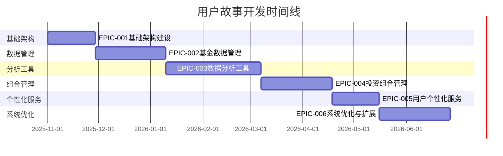

# 用户故事文档索引

## 📋 用户故事导航

欢迎来到基速基金量化分析平台的用户故事文档索引页面。本文档提供了完整的用户故事概览和导航信息。

---

## 🏗️ 史诗概览

### 史诗分类矩阵

| 史诗ID | 史诗名称 | 用户故事数量 | 优先级 | 复杂度 | 预估时长 | 状态 |
|--------|----------|--------------|--------|--------|----------|------|
| EPIC-001 | 基础架构建设 | 16个 | P0 | 高 | 4周 | ✅ 详细规划完成 |
| EPIC-002 | 基金数据管理 | 16个 | P0 | 高 | 6周 | ✅ 详细规划完成 |
| EPIC-003 | 数据分析工具 | 16个 | P1 | 高 | 8周 | ⏳ 规划中 |
| EPIC-004 | 投资组合管理 | 16个 | P1 | 中 | 6周 | ⏳ 规划中 |
| EPIC-005 | 用户个性化服务 | 16个 | P2 | 中 | 4周 | ⏳ 规划中 |
| EPIC-006 | 系统优化与扩展 | 16个 | P2 | 高 | 6周 | ⏳ 规划中 |

**总计**: 96个用户故事

---

## 📖 核心史诗文档

### 🏗️ EPIC-001: 基础架构建设

**史诗目标**: 建立稳固的技术基础架构，为后续功能开发提供可靠的技术支撑。

- **用户故事数量**: 16个
- **开发时间**: 4周
- **优先级**: P0 (最高优先级)
- **状态**: ✅ 详细规划完成
- **文档**: [查看详细用户故事](./EPIC-001-基础架构建设.md)

**包含的主要功能**:
- Flutter项目框架搭建
- 状态管理架构实现
- 网络通信和API集成
- 本地数据存储配置

**关键用户故事**:
- US-001.1: 搭建Flutter项目框架
- US-001.5: 实现BLoC状态管理架构
- US-001.9: 配置HTTP客户端和API通信
- US-001.13: 配置本地数据库(Hive)

---

### 📊 EPIC-002: 基金数据管理

**史诗目标**: 构建完整的基金数据管理系统，实现基金信息的获取、展示、搜索和筛选功能。

- **用户故事数量**: 16个
- **开发时间**: 6周
- **优先级**: P0 (最高优先级)
- **状态**: ✅ 详细规划完成
- **文档**: [查看详细用户故事](./EPIC-002-基金数据管理.md)

**包含的主要功能**:
- 基金信息展示系统
- 基金搜索和筛选功能
- 数据可视化和图表展示
- 基金详情页面

**关键用户故事**:
- US-002.1: 实现基金基本信息展示
- US-002.2: 开发基金净值历史数据展示
- US-002.5: 实现基金代码和名称搜索
- US-002.6: 开发智能搜索和联想功能

---

### 📈 EPIC-003: 数据分析工具

**史诗目标**: 开发专业的量化分析工具，为用户提供技术指标分析、风险评估、收益预测等高级分析功能。

- **用户故事数量**: 16个
- **开发时间**: 8周
- **优先级**: P1 (高优先级)
- **状态**: ⏳ 规划中
- **文档**: [待创建]

**包含的主要功能**:
- 技术指标分析
- 风险评估工具
- 收益分析工具
- 数据可视化

---

### 🎯 EPIC-004: 投资组合管理

**史诗目标**: 构建完整的投资组合管理系统，帮助用户创建、管理和优化投资组合。

- **用户故事数量**: 16个
- **开发时间**: 6周
- **优先级**: P1 (高优先级)
- **状态**: ⏳ 规划中
- **文档**: [待创建]

**包含的主要功能**:
- 组合创建功能
- 组合分析功能
- 组合优化工具
- 组合跟踪功能

---

### 👤 EPIC-005: 用户个性化服务

**史诗目标**: 开发个性化服务功能，包括用户偏好管理、智能推荐、收藏管理等。

- **用户故事数量**: 16个
- **开发时间**: 4周
- **优先级**: P2 (中优先级)
- **状态**: ⏳ 规划中
- **文档**: [待创建]

**包含的主要功能**:
- 收藏管理功能
- 提醒通知功能
- 个性化推荐
- 用户偏好设置

---

### 🚀 EPIC-006: 系统优化与扩展

**史诗目标**: 进行系统性能优化、功能扩展和技术升级，确保系统的可扩展性、稳定性和高性能表现。

- **用户故事数量**: 16个
- **开发时间**: 6周
- **优先级**: P2 (中优先级)
- **状态**: ⏳ 规划中
- **文档**: [待创建]

**包含的主要功能**:
- 性能优化
- 缓存优化
- 安全加固
- 监控运维

---

## 📊 故事开发时间线



---

## 🔍 按功能模块分类

### 基础架构模块 (16个故事)
- **框架搭建**: Flutter项目结构、开发环境配置
- **状态管理**: BLoC架构、全局状态管理
- **网络通信**: HTTP客户端、API集成、错误处理
- **数据存储**: 本地数据库、数据同步、迁移管理

### 数据管理模块 (16个故事)
- **数据展示**: 基金信息、净值历史、收益率统计
- **搜索功能**: 基础搜索、智能联想、搜索历史
- **筛选功能**: 多条件筛选、智能推荐
- **详情页面**: 基金详情、分红记录、同类对比

### 分析工具模块 (16个故事)
- **技术指标**: 基础指标、高级指标、自定义指标
- **风险评估**: 风险等级、最大回撤、波动率分析
- **收益分析**: 收益归因、收益预测、同类对比
- **数据可视化**: 交互式图表、多维度展示

### 组合管理模块 (16个故事)
- **组合创建**: 组合向导、基金添加、权重配置
- **组合分析**: 收益分析、风险评估、资产配置
- **组合优化**: 优化算法、风险分散、收益优化
- **组合跟踪**: 实时跟踪、历史记录、预警机制

### 个性化模块 (16个故事)
- **收藏管理**: 基金收藏、分组管理、数据同步
- **通知功能**: 价格提醒、新闻通知、自定义提醒
- **推荐系统**: 行为分析、智能推荐、个性化展示
- **偏好设置**: 界面偏好、数据偏好、隐私设置

### 系统优化模块 (16个故事)
- **性能优化**: 启动优化、加载优化、渲染优化
- **缓存优化**: 多级缓存、智能策略、预热机制
- **安全加固**: 数据加密、访问控制、安全监控
- **监控运维**: 性能监控、错误追踪、日志分析

---

## 🎯 优先级分布

### P0 - 必须实现 (32个故事)
- **EPIC-001**: 基础架构建设 (16个故事)
- **EPIC-002**: 基金数据管理 (16个故事)
- **开发时间**: 10周
- **关键路径**: 必须按顺序完成

### P1 - 应该实现 (32个故事)
- **EPIC-003**: 数据分析工具 (16个故事)
- **EPIC-004**: 投资组合管理 (16个故事)
- **开发时间**: 14周
- **依赖关系**: 依赖P0史诗完成

### P2 - 可以实现 (32个故事)
- **EPIC-005**: 用户个性化服务 (16个故事)
- **EPIC-006**: 系统优化与扩展 (16个故事)
- **开发时间**: 10周
- **灵活安排**: 可根据资源情况调整

---

## 📈 开发进度跟踪

### 当前状态
- **总故事数**: 96个
- **已完成规划**: 32个 (33.3%)
- **详细规划完成**: 32个 (33.3%)
- **待规划**: 64个 (66.7%)

### 已完成的详细规划
- ✅ EPIC-001: 基础架构建设 (16个故事)
- ✅ EPIC-002: 基金数据管理 (16个故事)

### 待完成的详细规划
- ⏳ EPIC-003: 数据分析工具 (16个故事)
- ⏳ EPIC-004: 投资组合管理 (16个故事)
- ⏳ EPIC-005: 用户个性化服务 (16个故事)
- ⏳ EPIC-006: 系统优化与扩展 (16个故事)

---

## 📝 用户故事标准格式

每个用户故事遵循以下标准格式：

```yaml
用户故事标题: 简洁描述用户需求
用户故事: 作为[用户角色]，我希望[功能描述]，以便[价值/目的]
优先级: [P0/P1/P2/P3]
复杂度: [低/中/高]
预估工期: [X天/X周]
依赖关系: [依赖的其他用户故事]
验收标准: [具体的验收条件列表]
技术要点: [技术实现的关键要点]
UI/UX要求: [界面和用户体验要求]
测试要点: [测试需要关注的重点]
```

---

## 🔗 相关文档

- **[主PRD文档](../prd.md)** - 产品需求和功能定义
- **[用户故事文档](../stories/用户故事文档.md)** - 用户故事概览和使用指南
- **[架构文档](../architecture/)** - 系统技术架构和设计规范
- **[API接口文档](../api/)** - 接口规范和数据格式

---

## 📋 开发团队指南

### 开发流程
1. **故事选择**: 按优先级和依赖关系选择用户故事
2. **需求理解**: 仔细阅读故事需求和验收标准
3. **技术设计**: 制定技术实现方案和架构设计
4. **编码实现**: 按照代码规范进行开发
5. **单元测试**: 编写和执行单元测试，确保覆盖率≥80%
6. **代码审查**: 提交代码审查请求
7. **集成测试**: 在测试环境验证功能
8. **用户验收**: 产品经理验收确认

### 质量标准
- **代码质量**: 静态分析无错误，符合编码规范
- **测试覆盖**: 单元测试覆盖率≥80%，集成测试通过
- **性能指标**: 满足性能要求，响应时间符合标准
- **用户体验**: 界面美观，操作流畅，错误提示友好
- **安全要求**: 通过安全检查，无高危安全问题

### 团队协作
- **开发团队**: 负责技术实现和代码质量
- **测试团队**: 负责功能测试和质量保证
- **产品团队**: 负责需求定义和验收确认
- **设计团队**: 负责界面设计和用户体验

---

## 💡 使用建议

1. **项目启动**: 从EPIC-001开始，按顺序完成每个史诗
2. **团队协作**: 不同团队可以并行开发不同的史诗
3. **进度跟踪**: 定期更新故事状态和进度信息
4. **质量保证**: 严格按照验收标准进行测试和验收
5. **持续改进**: 根据开发过程中的经验教训优化流程

---

*本文档将随着项目进展持续更新，确保与实际开发进度保持同步。如需查看具体故事的详细信息，请访问对应的史诗文档。*