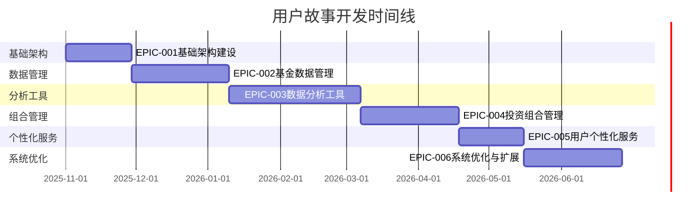

# 用户故事文档

## 📋 文档概述

本文档详细描述了基速基金量化分析平台的用户故事，基于PRD中定义的6个核心史诗，为每个用户故事提供具体的实施指导、验收标准和技术实现要点。

---

## 🏗️ 史诗概览

### 史诗分类

| 史诗ID | 史诗名称 | 用户故事数量 | 优先级 | 状态 |
|--------|----------|--------------|--------|------|
| EPIC-001 | 基础架构建设 | 16个 | P0 | 规划中 |
| EPIC-002 | 基金数据管理 | 16个 | P0 | 规划中 |
| EPIC-003 | 数据分析工具 | 16个 | P1 | 规划中 |
| EPIC-004 | 投资组合管理 | 16个 | P1 | 规划中 |
| EPIC-005 | 用户个性化服务 | 16个 | P2 | 规划中 |
| EPIC-006 | 系统优化与扩展 | 16个 | P2 | 规划中 |

**总计**: 96个用户故事

### 开发时间规划



---

## 📖 用户故事阅读指南

### 用户故事标准格式

每个用户故事遵循以下标准格式：

```yaml
用户故事格式:
  标题: 简洁描述用户需求
  用户故事: 作为[用户角色]，我希望[功能描述]，以便[价值/目的]
  优先级: [P0/P1/P2/P3]
  复杂度: [低/中/高]
  预估工期: [X天/X周]
  依赖关系: [依赖的其他用户故事]
  验收标准: [具体的验收条件列表]
  技术要点: [技术实现的关键要点]
  UI/UX要求: [界面和用户体验要求]
  测试要点: [测试需要关注的重点]
```

### 优先级说明

- **P0 (Must Have)**: 核心功能，必须实现
- **P1 (Should Have)**: 重要功能，应该实现
- **P2 (Could Have)**: 期望功能，可以实现
- **P3 (Won't Have)**: 延后功能，暂不实现

### 复杂度评估

- **低**: 1-3天，简单的CRUD操作或配置
- **中**: 4-7天，涉及业务逻辑或第三方集成
- **高**: 8-14天，复杂算法或多个模块集成

---

## 🔗 相关文档

- **[PRD产品需求文档](../prd.md)** - 产品需求和功能定义
- **[架构设计文档](../architecture/)** - 技术架构和设计规范
- **[API接口文档](../api/)** - 接口规范和数据格式
- **[QA测试文档](../qa/)** - 测试策略和测试用例

---

## 📝 文档维护

- **文档版本**: v1.0
- **创建时间**: 2025-10-30
- **最后更新**: 2025-10-30
- **维护团队**: 产品团队、开发团队
- **更新频率**: 每个Sprint结束后更新

---

## 💡 使用说明

1. **开发团队**: 按照用户故事进行功能开发，确保满足所有验收标准
2. **测试团队**: 基于用户故事制定测试计划，确保功能质量
3. **产品团队**: 跟踪用户故事进度，及时调整优先级和需求
4. **设计团队**: 根据UI/UX要求进行界面设计和用户体验优化

---

*本文档将随着项目进展持续更新，确保与实际开发进度保持同步。*